# VR-Rajasthan

    Virtual Reality is a technology which is being most popular these days.
    One of the reason is because of 360 viewing, people are excited to 
    experience the feel of 360 videos. Mostly people are using vr 
    technology for entertainment purpose.
    
    In Rajasthan many festivals celebrate.Gangaur and Teej are the different
    festivals which are only celebrate in Rajasthan. These are the biggest
    festival in Rajasthan. In Rajasthan also celebrate Holi, Makar Sankranti,
    Diwali, Basant Panchami, Rakshabandhan and many more.
    
## Screenshots of Project

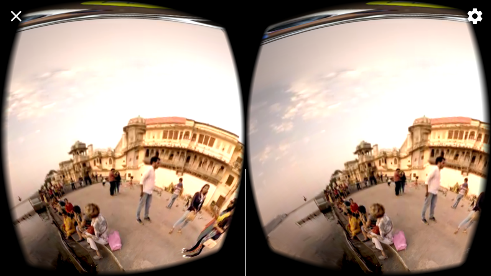
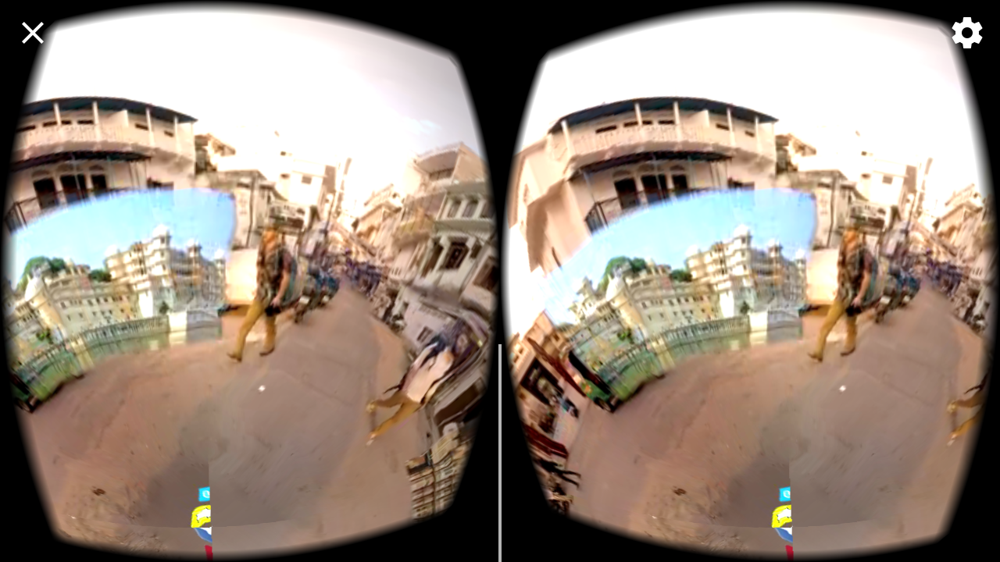
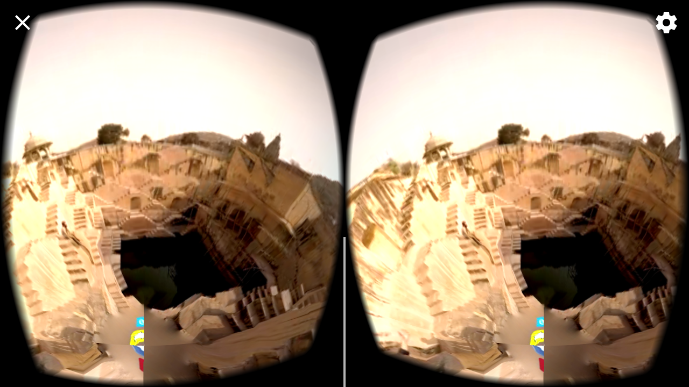
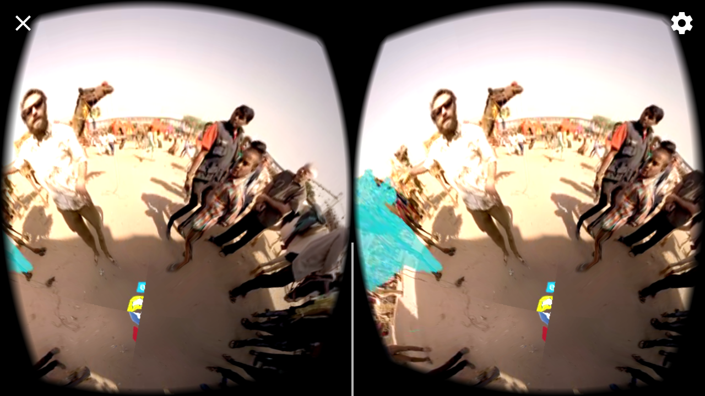
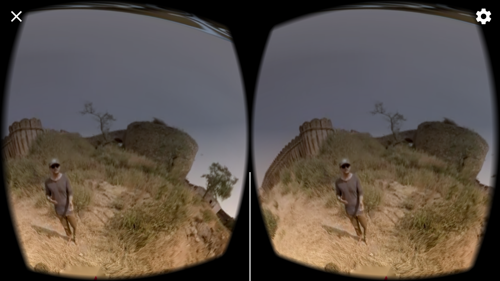
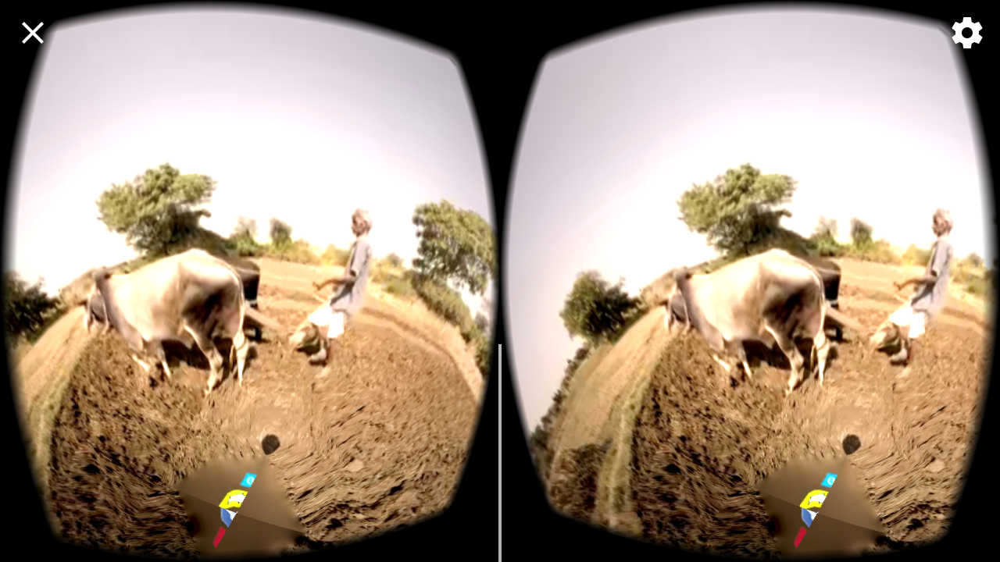
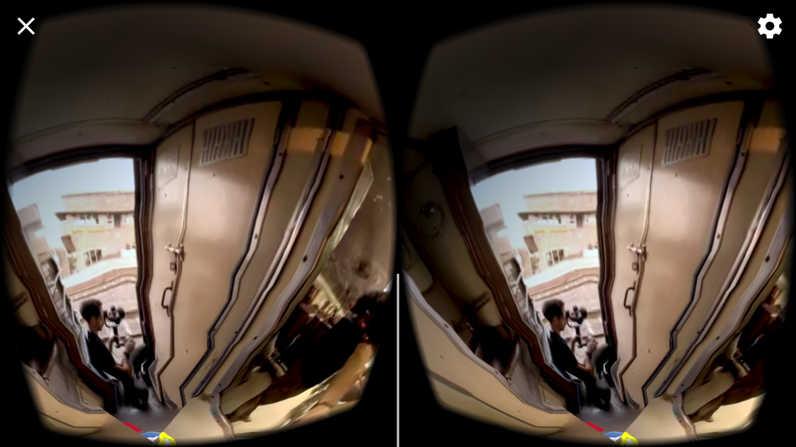
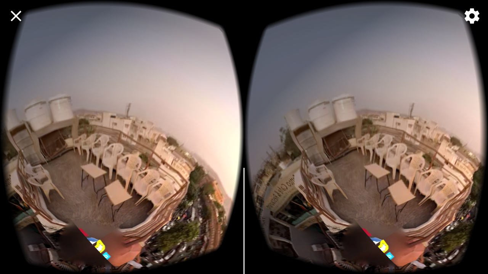
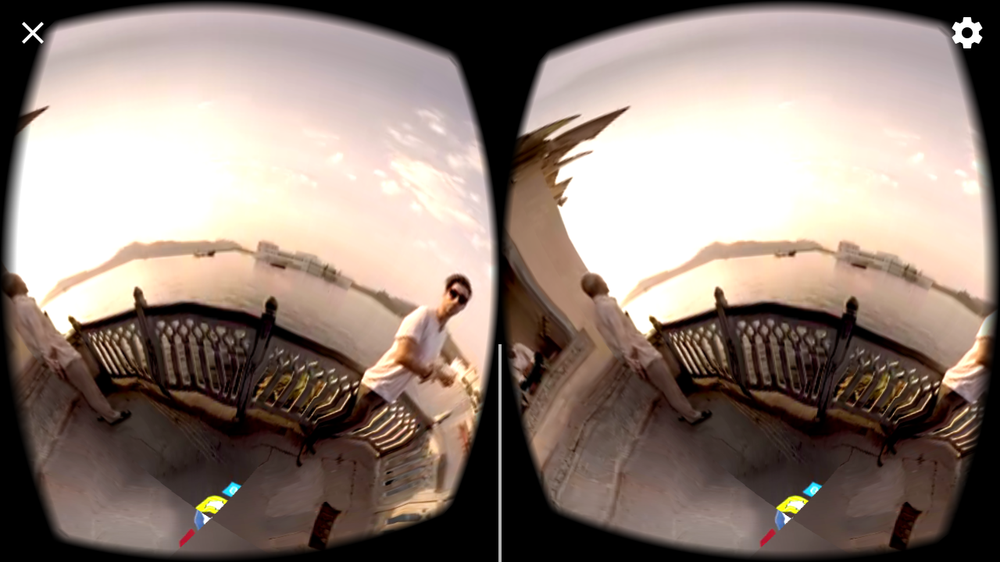
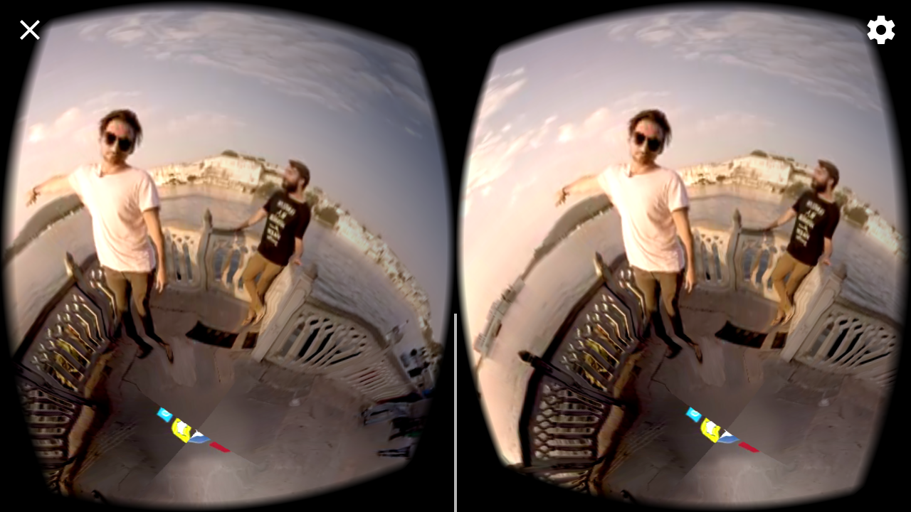
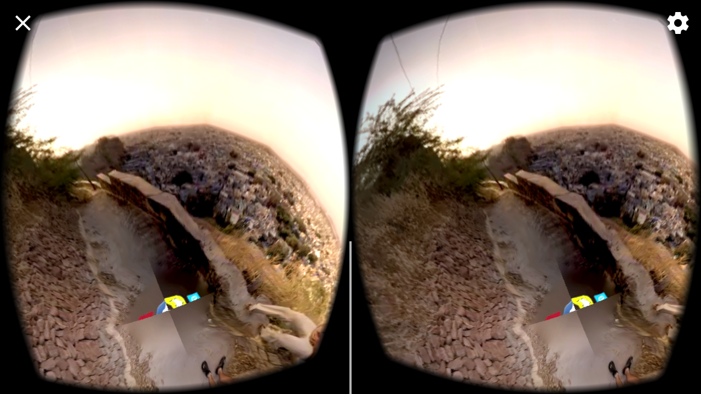

